# Pengenalan

Halo, selamat bergabung di **UXD | PHP Indonesia** sebuah komunitas di bawah naungan PHP Indonesia yang berfokus pada tema UI / UX & Frontend Developer. Hari ini Minggu (12 / 01) 2018 adalah pertama kalinya komunitas **UXD | PHP Indonesia** mengadakan workshop. 

Sebelumnya perkenalkan nama saya **Muhibbudin Suretno** founder dan admin group **UXD | PHP Indonesia**, saat ini saya bekerja sebagai Sr. Frontend Developer di sebuah marketplace perhiasan online di Jakarta.

Dan pada workshop pertama ini saya akan membawakan materi mengenai **Design To HTML**, dengan fokus pada pembuatan struktur template dan responsive web design.

#### Tentang Tema

Di desain kali ini saya membawa sebuah ide mengenai Studio Foto bernama **The Photograph** yang pada dasarnya adalah hasil research saya pada seorang teman yang memiliki usaha di bidang Photo Studio dan saya cukup banyak mendapatkan insight darinya terutama fitur apa saja yang biasa–nya orang butuhkan pada sebuah studio foto.

#### Daftar Isi

- [Pengenalan](?id=pengenalan)
- [Daftar Isi](?id=daftar-isi)
- [Inisialisasi proyek](?id=inisialisasi-proyek)
- [Memahami struktur proyek](?id=memahami-struktur-proyek)
- [Berkenalan dengan SASS / SCSS](?id=berkenalan-dengan-sass-scss)
- [Membuat Navbar](?id=membuat-navbar)
- [Membuat Section Hero](?id=membuat-section-hero)
- [Membuat Section Introduction](?id=membuat-section-introduction)
- [Membuat Section Services](?id=membuat-section-services)
- [Membuat Section Promotion](?id=membuat-section-promotion)
- [Membuat Section Prices](?id=membuat-section-prices)
- [Membuat Section Client Says](?id=membuat-section-client-says)
- [Membuat Section Footer](?id=membuat-section-footer)
- [Membuat Copyright](?id=membuat-copyright)
- [Kesimpulan](?id=kesimpulan)
- [Penutup](?id=penutup)

#### Inisialisasi proyek

Sebelum memulai anda di wajibkan menyiapkan environment dan software yang akan kita butuhkan, diantaranya seperti di bawah ini :

- [Git](https://git-scm.com/downloads)
- [Ruby SASS](https://sass-lang.com/install)

> Jika anda belum pernah memakai Ruby sebelumnya, silahkan download & install terlebih dahulu melalui [tautan berikut.](https://www.ruby-lang.org/id/documentation/installation/)

Selanjutnya anda dapat men–download source skeleton yang akan kita gunakan pada proyek ini dengan cara seperti berikut :

- Menggunakan GIT via SSH :
  `$ git clone git@github.com:muhibbudins/uxd-workshop.git`
- Menggunakan GIT via HTTPS :
  `$ git clone https://github.com/muhibbudins/uxd-workshop.git`
- Men-*download* langsung dari *source* :
  [klik disini](https://github.com/muhibbudins/uxd-workshop/archive/master.zip)

Setelah semuanya selesai, silahkan buka skeleton yang sudah di download serta buka **Command prompt / Terminal** pada folder tersebut. Lalu jalankan _Ruby SASS_ dengan command berikut :

``` bash
$ sass --watch scss/main.scss:css/main.css
```

#### Memahami struktur proyek

Berikut adalah struktur folder yang akan kita gunakan pada proyek ini :

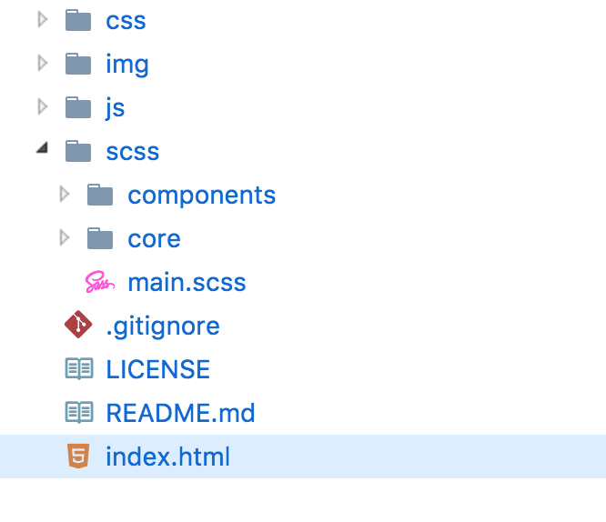

Pada gambar di atas kita dapat melihat beberapa folder di antaranya **css, img, js, scss** serta beberapa file seperti **.gitignore, LICENSE, README.md** dan **index.html** dengan keterangan sebagai berikut :

- **css** : Folder dimana hasil compile file .scss di simpan _(destination directory)_
- **img** : Folder untuk menyimpan asset file hasil slicing dari desain
- **js** : Folder untuk menyimpan semua script JavaScript yang digunakan pada aplikasi
- **scss** : Folder utama untuk file SASS dengan format .scss
- **index.html** : File utama yang akan di panggil oleh browser

> Hanya file _main.scss_ pada folder **scss** yang akan di compile dan pada folder ini berisi sub folder **components** & **core** yang menjadi tempat kita menyimpan file .scss yang nantinya di panggil pada file main.scss

#### Berkenalan dengan SASS / SCSS

SASS adalah sebuah CSS Preprocessor yang cukup populer saat ini karena kemudahan dalam pengaplikasiannya pada proyek besar maupun kecil, SASS memiliki dua format file yang cukup berbeda secara syntax yaitu **.sass** & **.scss** perbedaan yang cukup mencolok itu adalah syntax **.sass** tidak mendukung penggunaan { bracket } dan ; (semi-colon) seperti bahasa ibunya yaitu Ruby. Namun berbeda dengan syntax **.scss** yang secara struktur 100% sama dengan file CSS pada umumnya, tapi dengan beberapa keunggulan lain yang tidak ada pada bahasa CSS biasa.

Berikut adalah contoh penggunaan SASS dengan syntax (format) **.scss** :

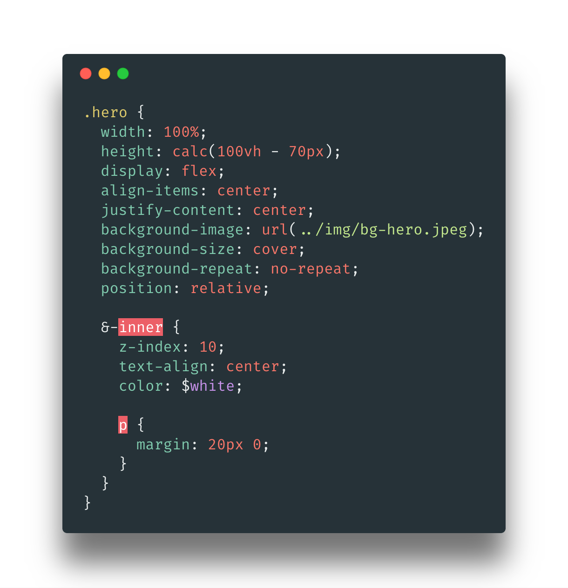

Sangat mirip dengan CSS bukan? bedanya hanya pada bentuk _nesting_. Jika pada syntax CSS kita biasa melakukan _nesting_ seperti ini :

``` scss
.foo {
  color: blue;
}
.foo.bar {
  background-color: red;
}
.foo.bar > p {
  font-size: 16px;
}
```

Maka pada SCSS kita dapat mempersingkatnya menjadi seperti ini :

``` scss
.foo {
  color: blue;

  &.bar {
    background-color: red;

    &> p {
      font-size: 16px;
    }
  }
}
```

Dengan menggunakan SASS / SCSS kita dapat mempersingkat menulis ulang class **.foo** serta child—nya, selain itu masih ada lagi kelebihan lain saat kita menggunakan SASS / SCSS sebagai CSS Pre-processor contohnya :

- [Conditional](http://sass-lang.com/documentation/file.SASS_REFERENCE.html#if)
- [Loop](http://sass-lang.com/documentation/file.SASS_REFERENCE.html#for)
- [Array](http://sass-lang.com/documentation/file.SASS_REFERENCE.html#each-directive)
- [Mixin (Function)](http://sass-lang.com/documentation/file.SASS_REFERENCE.html#mixins)

> Selengkapnya bisa anda pelajari pada [link berikut.](http://sass-lang.com/guide)

Dan pada proyek ini saya telah menambahkan beberapa _helper_ yang akan membantu kita dan yang telah saya simpan pada folder **scss/core**, yaitu diantaranya :

- Animation delay
- Color variable
- Fonts variable
- Responsive utility
- Text utility

# Mulai Mengerjakan Proyek

#### Membuat Navbar

Selanjutnya yang akan kita buat pertama adalah bagian **navbar**, tapi sebelumnya kita akan coba rubah bagian _body_ pada **main.scss** menjadi seperti berikut :

```scss
...
// global style
body {
  font-family: $quicksand;
  font-size: 16px;
  background-color: $dark;
}
```

Lalu kita coba buat bagian navbar seperti pada gambar di bawah ini.


Yang kita lakukan pertama kali adalah membuat menunya dahulu, silahkan buka file **index.html** dan replace bagian code berikut :

```html
  <!-- Start your code -->

  <div class="col-6 text-center">
    <h1>Hi, Welcome!</h1>
    <p class="text-secondary">Now write your imagination and think this browser is a canvas.</p>
  </div>

  <!-- End your code -->
```

Menjadi seperti ini :

```html
  <!-- Navbar -->
  <nav class="navbar navbar-expand-lg">  
    <div class="container">
      <a class="navbar-brand" href="#">Brand</a>
      <ul class="navbar-nav ml-auto">
        <li class="nav-item">
          <a class="nav-link" href="#">Home</a>
        </li>
        <li class="nav-item dropdown">
          <a class="nav-link dropdown-toggle" href="#" id="navbarDropdown" role="button" data-toggle="dropdown" aria-haspopup="true" aria-expanded="false">
            Categories
          </a>
          <div class="dropdown-menu" aria-labelledby="navbarDropdown">
            <a class="dropdown-item" href="#">Action</a>
            <a class="dropdown-item" href="#">Another action</a>
          </div>
        </li>
        <li class="nav-item">
          <a class="nav-link" href="#">Gallery</a>
        </li>
        <li class="nav-item">
          <a class="nav-link" href="#">Team</a>
        </li>
        <li class="nav-item">
          <a class="nav-link" href="#">About Us</a>
        </li>
      </ul>
    </div>
  </nav>
```

Selanjutnya silahkan buka file index.html pada browser maka hasilnya adalah seperti berikut :

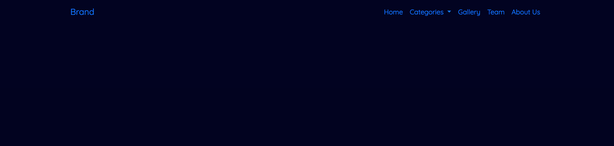

Sekarang kita coba styling bagian navbar ini agar sama dengan desain yang telah di buat, silahkan tambahkan code berikut pada file **components/_navbar.scss**.

```scss
// Hoverable Mixin
@mixin hoverable() {
  &:hover,
  &:focus,
  &:active {
    color: transparentize($white, 0);
  }
}

// Main navbar
.navbar {
  background-color: $indigo;

  &-brand {
    font-size: 28;
    font-family: $lobster;
    color: transparentize($white, 0.2);

    @include hoverable();
  }
  
  // Navbar item
  .nav {
    &-item {
      padding: 8px 10px;
    }
    &-link {
      font-size: 14px;
      color: transparentize($white, 0.2);
  
      @include hoverable();
    }
  }
}

// Dropdown Arrow
.dropdown-toggle {
  &:after {
    border: 0;
    content: "\f3d0";
    display: inline-block;
    font-family: "Ionicons";
    speak: none;
    font-style: normal;
    font-weight: normal;
    font-variant: normal;
    text-transform: none;
    text-rendering: auto;
    line-height: 1;
    -webkit-font-smoothing: antialiased;
    vertical-align: 0;
  }
}
```

> Pada code di atas pada line awal saya membuat sebuah **mixin** bernama **hoverable** yang berguna untuk membuat pseudo class yang akan di panggil pada beberapa class yaitu _.navbar_brand_ dan _.nav-link_.

Dan hasilnya adalah seperti berikut :

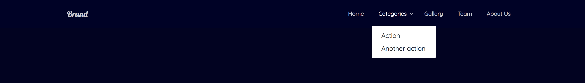

<!-- Divider -->
<p align="center">:wavy_dash::wavy_dash::wavy_dash::wavy_dash:</p>
<!-- Divider -->


#### Membuat Section Hero

Selanjutnya kita akan membuat bagian hero seperti desain berikut :

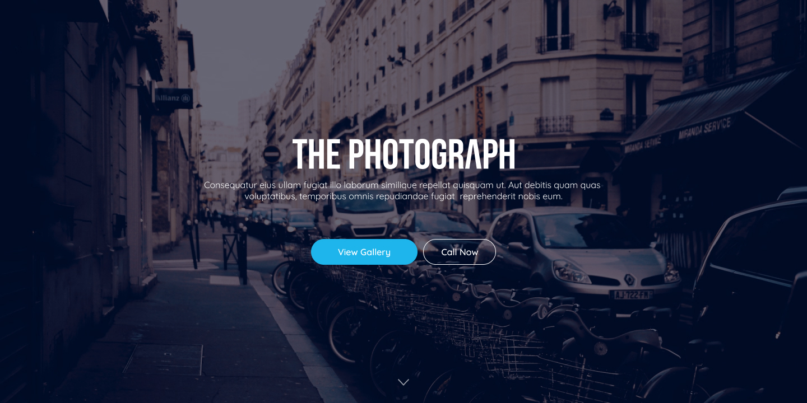

Silahkan tambahkan code berikut, setelah bagian <~~ Navbar ~~>.

```html
  <!-- Hero -->
  <section class="section section-overlay">
    <div class="section-overlay-inner">
      
      <p>Consequatur eius ullam fugiat illo laborum similique repellat quisquam ut. Aut debitis quam quas <br> voluptatibus, temporibus omnis repudiandae fugiat  reprehenderit nobis eum.</p>
      <div class="section-overlay-button">
        <a href="#" class="btn btn-info">View Gallery</a>
        <a href="#" class="btn btn-outline-white">Call</a>
      </div>
    </div>
  </section>
```

Pada code HTML di atas kita coba membuat sebuah section hero yang berisi ucapan selamat datang, yang jika kalian buka pada browser hasilnya seperti berikut :

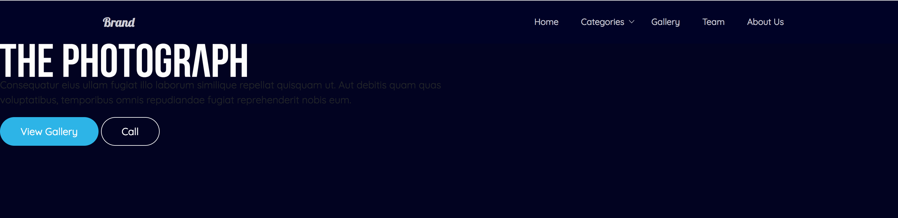

Sepertinya masih belum bagus, selanjutnya kita coba tambahkan beberapa style untuk bagian hero ini. Kita buka file **components/_section.scss** dan pertama kita tambahkan adalah style utama untuk bagian section.

Code–nya seperti di bawah ini :

```scss
.section {
  width: 100%;
  min-height: 400px;
  padding: 60px 0;
  color: $white;
}
```

Lalu kita tambahkan sub-class _.section-overlay_ untuk mempercantik bagian hero tersebut, silahkan tambahkan code di bawah ini kedalam class _.section_ :

```scss
.section {

  ...
  &-overlay {
    width: 100%;
    height: calc(100vh - 70px);
    display: flex;
    align-items: center;
    justify-content: center;
    background-image: url(../img/bg-hero.jpeg);
    background-size: cover;
    background-repeat: no-repeat;
    position: relative;
  
    &:before {
      content: '';
      position: absolute;
      top: 0;
      left: 0;
      bottom: 0;
      right: 0;
      background-color: transparentize($dark, 0.4);
      z-index: 0;
    }
    &-inner {
      z-index: 100;
      text-align: center;
      color: $white;
  
      img {
        width: 390px;
        height: auto
      }
      p {
        margin: 20px 0;
      }
    }
    &-button {
      margin-top: 40px;
  
      .btn {
        margin: 0 5px;
      }
    }
  }
}
```

Selanjutnya untuk bagian button kita tambahkan code berikut pada file **components/_button.scss** :

```scss
// Hoverable Mixin
@mixin hoverable() {
  &:hover,
  &:focus,
  &:active {
    color: $white;
    border: 1px solid $blue;
    background-color: darken($blue, 4%);
  }
}

.btn {
  padding: 10px 32px;
  border-radius: 30px;
  border: 1px solid $blue;

  &-info {
    background-color: $blue;

    @include hoverable();
  }
  &-outline {
    &-info {
      background-color: transparent;
      color: $blue;
  
      @include hoverable();
    }
    &-white {
      background-color: transparent;
      border-color: $white;
      color: $white;
  
      @include hoverable();
    }
  }
}
```

Dan hasilnya adalah seperti bisa kita lihat di bawah ini :

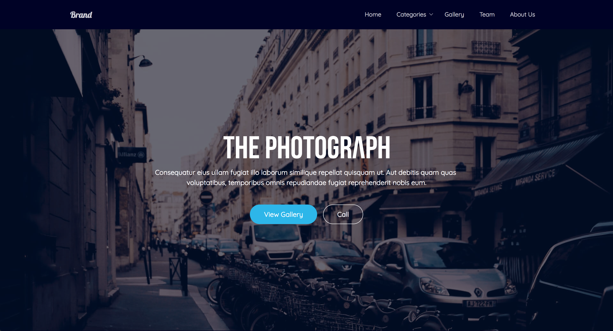

Terlihat lebih rapi bukan? Bagian navbar dan hero sudah, selanjutnya kita coba masuk ke bagian **Introduction.** :smile:

<!-- Divider -->
<p align="center">:wavy_dash::wavy_dash::wavy_dash::wavy_dash:</p>
<!-- Divider -->

#### Membuat Section Introduction

Pada bagian ini kita coba membuat intro dari **The Photograph** kira-kira isinya itu hanya title, description serta link menuju sosmed seperti pada gambar di bawah.

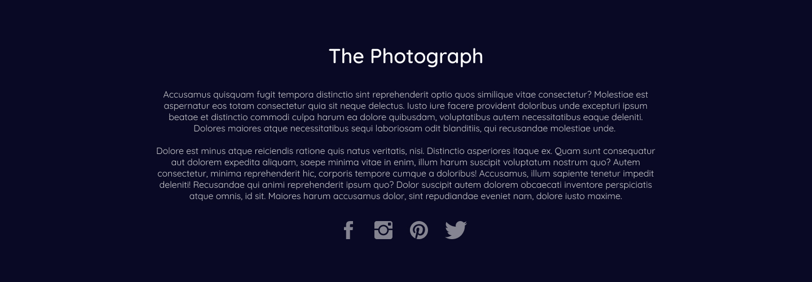

Pertama, silahkan tambahkan code berikut setelah bagian <~~ Hero ~~> 

```html
  <!-- Introduction -->
  <section class="section section-indigo">
    <div class="container">
      <div class="row">
        <div class="col-9 mx-auto text-center">
          <div class="text-xlarge mb-4">The Photograph</div>
          <p class="text">Accusamus quisquam fugit tempora distinctio sint reprehenderit optio quos similique vitae consectetur? Molestiae est aspernatur eos totam consectetur quia sit neque delectus. Iusto iure facere provident doloribus unde excepturi ipsum beatae et distinctio commodi culpa harum ea dolore quibusdam, voluptatibus autem necessitatibus eaque deleniti. Dolores maiores atque necessitatibus sequi laboriosam odit blanditiis, qui recusandae molestiae unde. </p>
          <p class="text">Dolore est minus atque reiciendis ratione quis natus veritatis, nisi. Distinctio asperiores itaque ex. Quam sunt consequatur aut dolorem expedita aliquam, saepe minima vitae in enim, illum harum suscipit voluptatum nostrum quo? Autem consectetur, minima reprehenderit hic, corporis tempore cumque a doloribus! Accusamus, illum sapiente tenetur impedit deleniti! Recusandae qui animi reprehenderit ipsum quo? Dolor suscipit autem dolorem obcaecati inventore perspiciatis atque omnis, id sit. Maiores harum accusamus dolor, sint repudiandae eveniet nam, dolore iusto maxime.</p>
          <nav class="nav justify-content-center">
            <a class="nav-link nav-social text-icon" href="#">
              <i class="ion-social-facebook"></i>
            </a>
            <a class="nav-link nav-social text-icon" href="#">
              <i class="ion-social-instagram"></i>
            </a>
            <a class="nav-link nav-social text-icon" href="#">
              <i class="ion-social-pinterest"></i>
            </a>
            <a class="nav-link nav-social text-icon" href="#">
              <i class="ion-social-twitter"></i>
            </a>
          </nav>
        </div>
      </div>
    </div>
  </section>
```

Selanjutnya kita rubah warna background section tersebut, dengan menambahkan beberapa baris code pada file **components/_section.scss**. Dan tambahkan sebelum code `&-overlay`.

```scss
// _section.scss
  ...
  &-indigo {
    background-color: $indigo;
  }
  ...
```

Maka hasilnya adalah seperti berikut ini :

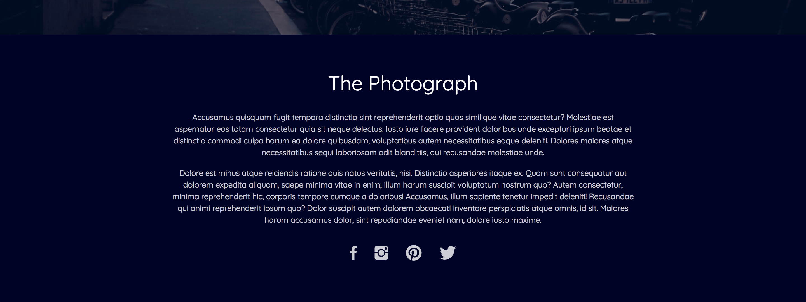


<!-- Divider -->
<p align="center">:wavy_dash::wavy_dash::wavy_dash::wavy_dash:</p>
<!-- Divider -->


#### Membuat Section Services


Di bagian ini akan cukup sulit karena kita akan menambahkan lumayan banyak code pada beberapa file terpisah, yang pertama kita coba tambahkan markup HTML untuk bagian ini setelah bagian introduction.

Silahkan tambahkan code pada file **index.html** seperti berikut ini :

```html
  <!-- Services -->
  <section class="section section-service">
    <div class="container-fluid">
      <div class="row">
        <div class="col-9 mx-auto text-center">
          <div class="text-xlarge mb-4">Our Services</div>
        </div>
      </div>
    </div>
    <div class="grid">
      <div class="grid-item">
        
        <div class="grid-overlay">
          <div class="grid-title">Wedding Photo</div>
          <div class="grid-description">Consequatur eius ullam fugiat illo laborumsimilique repellat quisquam ut. Aut debitis quam quas  voluptatibus.</div>
          <a href="#" class="btn btn-outline-info">Read More</a>
        </div>
      </div>
      <div class="grid-item">
        
        <div class="grid-overlay">
          <div class="grid-title">Family Photo</div>
          <div class="grid-description">Consequatur eius ullam fugiat illo laborumsimilique repellat quisquam ut. Aut debitis quam quas  voluptatibus.</div>
          <a href="#" class="btn btn-outline-info">Read More</a>
        </div>
      </div>
      <div class="grid-item">
        
        <div class="grid-overlay">
          <div class="grid-title">Graduation</div>
          <div class="grid-description">Consequatur eius ullam fugiat illo laborumsimilique repellat quisquam ut. Aut debitis quam quas  voluptatibus.</div>
          <a href="#" class="btn btn-outline-info">Read More</a>
        </div>
      </div>
      <div class="grid-item">
        
        <div class="grid-overlay">
          <div class="grid-title">Couple Photo</div>
          <div class="grid-description">Consequatur eius ullam fugiat illo laborumsimilique repellat quisquam ut. Aut debitis quam quas  voluptatibus.</div>
          <a href="#" class="btn btn-outline-info">Read More</a>
        </div>
      </div>
      <div class="grid-item">
        
        <div class="grid-overlay">
          <div class="grid-title">Milenial Photo</div>
          <div class="grid-description">Consequatur eius ullam fugiat illo laborumsimilique repellat quisquam ut. Aut debitis quam quas  voluptatibus.</div>
          <a href="#" class="btn btn-outline-info">Read More</a>
        </div>
      </div>
      <div class="grid-item">
        
        <div class="grid-overlay">
          <div class="grid-title">Exclusive Photo</div>
          <div class="grid-description">Consequatur eius ullam fugiat illo laborumsimilique repellat quisquam ut. Aut debitis quam quas  voluptatibus.</div>
          <a href="#" class="btn btn-outline-info">Read More</a>
        </div>
      </div>
    </div>
  </section>
```

Untuk styling-nya pertama kita ubah bagian background service, dengan menambahkan code berikut setelah **&-indigo** pada file **components/_section.scss**.

```scss
  &-service {
    background-color: $black;
    padding-bottom: 0;
  }
```

Lalu pada tambahkan code berikut pada file **components/_grid.scss** yang berguna untuk membuat grid card.

```scss
.grid {
  width: 100%;
  display: flex;
  flex-wrap: wrap;

  &-item {
    width: calc(100% / 3);
    height: 300px;
    position: relative;
    overflow: hidden;

    img {
      position: absolute;
      top: 50%;
      left: 50%;
      transform: translateX(-50%) translateY(-50%);
      width: 100%;
      height: auto;
      transition: all 0.8s ease;
    }
    &:hover > .grid-overlay {
      opacity: 1;
    }
    &:hover > img {
      filter: grayscale(100);
      transform: scale(1.2) translateX(-40%) translateY(-40%);
    }
  }
  &-overlay {
    position: absolute;
    top: 0;
    left: 0;
    bottom: 0;
    right: 0;
    background-color: transparentize($black, 0.4);
    z-index: 10;
    display: flex;
    align-items: center;
    justify-content: center;
    flex-direction: column;
    text-align: center;
    padding: 0 60px;
    opacity: 0;
    transition: opacity 0.3s ease;
  }
  &-title {
    font-size: 28px;
  }
  &-description {
    font-size: 14px;
    margin: 20px 0;
  }
}
```

> Pada beberapa class di atas saya menambahkan property transition yang berguna untuk membuat animasi pada setiap item card

Dan hasilnya adalah seperti berikut ini.


<!-- Divider -->
<p align="center">:wavy_dash::wavy_dash::wavy_dash::wavy_dash:</p>
<!-- Divider -->


#### Membuat Section Promotion

Selanjutnya kita buat bagian promotion yang berisi countdown seperti gambar di bawah ini dan pada bagian ini pun kita akan menambahkan banyak code pada file terpisah, jadi usahakan perhatikan baik-baik dimana seharusnya kita menambahkan code yang bersangkutan.

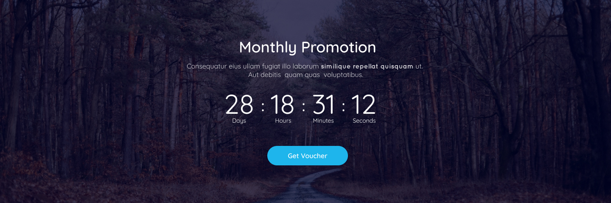

Pertama kita tambahkan markup HTML pada file **index.html** yang isinya adalah seperti berikut.

```html
  <!-- Voucher -->
  <section class="section section-overlay section-overlay-voucher">
    <div class="container">
      <div class="row">
        <div class="col-9 mx-auto text-center">
          <div class="text-xlarge mb-4">Monthly Promotion</div>
          <p class="text">Consequatur eius ullam fugiat illo laborum similique repellat quisquam ut. <br> Aut debitis  quam quas  voluptatibus.</p>
          <div class="countdown"></div>
          <div class="section-overlay-button">
            <a href="#" class="btn btn-info">Get Voucher</a>
          </div>
        </div>
      </div>
    </div>
  </section>
```

Selanjutnya kita tambahkan fungsi javascript untuk menjalankan countdown pada bagian `<div class="countdown"></div>` , silahkan copy paste code berikut ini dan masukan kedalam file **js/main.js**.

```javascript
$(document).ready(function() {

  // Start Countdown
  var endDate = "June 30, 2018 00:00:00";
  $('.countdown').countdown({
    date: endDate,
    render: function(data) {
      $(this.el).html(
        "<div class=\"countdown-item\">" + 
          this.leadingZeros(data.days, 3) + " <div class=\"countdown-text\">Days</div>"+
        "</div>"+
        "<div class=\"countdown-separator\">:</div>"+
        "<div class=\"countdown-item\">" + 
          this.leadingZeros(data.hours, 2) + " <div class=\"countdown-text\">Hours</div>"+
        "</div>"+
        "<div class=\"countdown-separator\">:</div>"+
        "<div class=\"countdown-item\">" + 
          this.leadingZeros(data.min, 2) + " <div class=\"countdown-text\">Minutes</div>"+
        "</div>"+
        "<div class=\"countdown-separator\">:</div>"+
        "<div class=\"countdown-item\">" + 
          this.leadingZeros(data.sec, 2) + " <div class=\"countdown-text\">Seconds</div>"+
        "</div>"
      );
    }
  });

});
```

Dan hasilnya adalah seperti berikut, masih kurang rapi dan bagian backgroundnya pun masih salah.

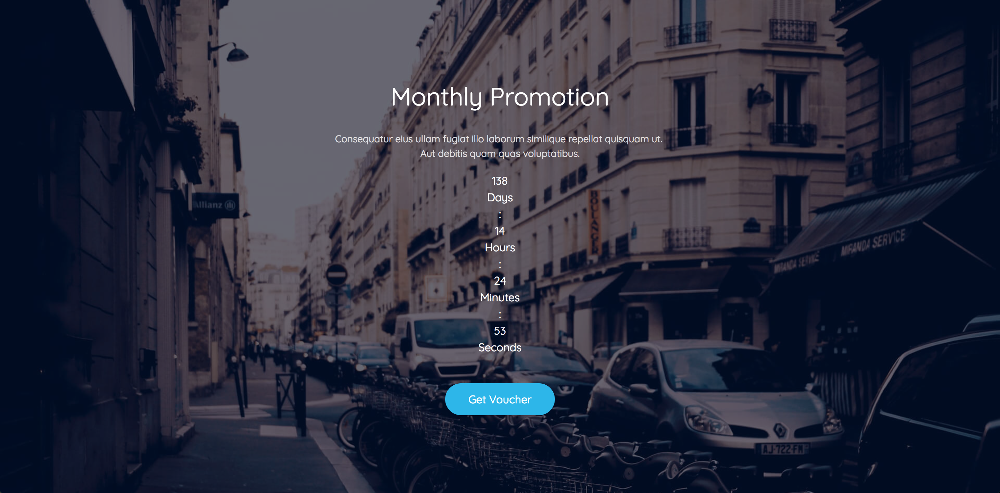

Maka dari itu kita tambahkan beberapa style pada file **components/_countdown.scss** seperti berikut ini.

```scss
.countdown {
  display: flex;
  align-items: center;
  justify-content: center;

  &-item {
    font-size: 64px;
    line-height: 1.2;
  }
  &-text {
    font-size: 14px;
  }
  &-separator {
    font-size: 36px;
    margin: 0 20px;
  }
}
```

Lalu bagian **section** juga kita rubah sedikit dengan menambahkan code berikut setelah bagian **&-button** pada class _.section-overlay_.

```scss
    &-voucher {
      min-height: 400px;
      height: auto;
      background-image: url(../img/bg-promotion.jpeg);

      &:before {
        background-color: transparentize($dark, 0.25);
      }
      p {
        margin: 0;
      }
    }
```

Dan hasilnya adalah seperti berikut ini, tampak lebih rapi dan sesuai dengan desain yang telah kita buat.


<!-- Divider -->
<p align="center">:wavy_dash::wavy_dash::wavy_dash::wavy_dash:</p>
<!-- Divider -->


#### Membuat Section Prices

Selanjutnya yang akan kita buat adalah bagian prices, dimana bagian ini kita membuat table pricing dari setiap paket foto yang dimiliki oleh **The Photograph** kira-kira tampilannya seperti berikut.

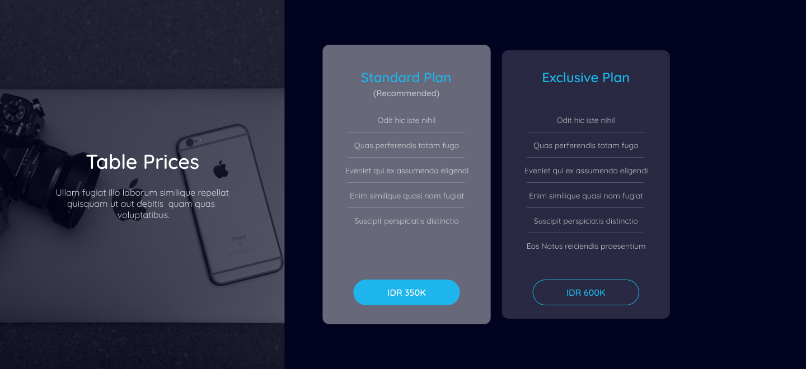

Lalu untuk pertama silahkan tambahkan code HTML berikut setelah bagian **voucher**.

```html
<section class="section section-price">
    <div class="container-fluid">
      <div class="row">
        <div class="col-4 text-center section section-overlay-price">
          <div class="section-overlay-inner">
            <div class="text-xlarge mb-4">Table Prices</div>
            <p class="animated delay-1 fadeInUp">Ullam fugiat illo laborum similique repellat <br> quisquam ut aut debitis  quam quas <br> voluptatibus.</p>
          </div>
        </div>
        <div class="col-8 p-5 text-center">
          <div class="card-list">
              <div class="card card-active">
                <div class="card-body">
                  <h5 class="card-title">Standard Plan</h5>
                  <div class="card-subtitle">(Recommended)</div>
                  <ul class="nav flex-column">
                    <li class="nav-item">
                      Odit hic iste nihil
                    </li>
                    <li class="nav-item">
                      Quas perferendis totam fuga
                    </li>
                    <li class="nav-item">
                      Eveniet qui ex assumenda eligendi
                    </li>
                    <li class="nav-item">
                      Enim similique quasi nam fugiat
                    </li>
                    <li class="nav-item">
                      Suscipit perspiciatis distinctio
                    </li>
                  </ul>
                  <a href="#" class="btn btn-info">IDR 350K</a>
                </div>
              </div>
              <div class="card">
                <div class="card-body">
                  <h5 class="card-title">Exclusive Plan</h5>
                  <ul class="nav flex-column">
                    <li class="nav-item">
                      Odit hic iste nihil
                    </li>
                    <li class="nav-item">
                      Quas perferendis totam fuga
                    </li>
                    <li class="nav-item">
                      Eveniet qui ex assumenda eligendi
                    </li>
                    <li class="nav-item">
                      Enim similique quasi nam fugiat
                    </li>
                    <li class="nav-item">
                      Suscipit perspiciatis distinctio
                    </li>
                    <li class="nav-item">
                      Eos Natus reiciendis praesentium
                    </li>
                  </ul>
                  <a href="#" class="btn btn-outline-info">IDR 600K</a>
                </div>
              </div>
          </div>
        </div>
      </div>
    </div>
  </section>
```

Dan kira-kira seperti ini hasilnya.

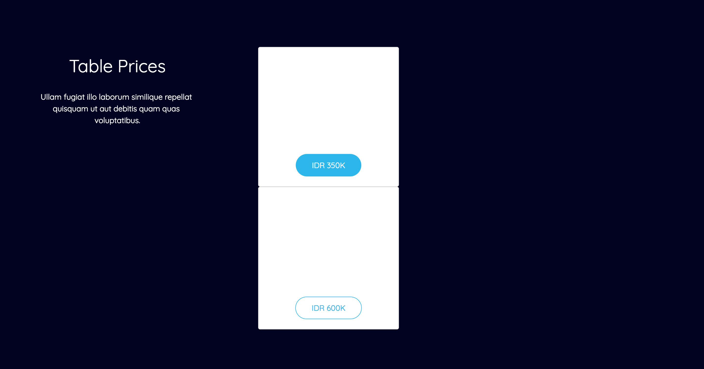

Selanjutnya kita tambahkan code berikut di dalam code **&-overlay** pada file **components/_section.scss** untuk membuat overlay pada bagian sebelah kiri.

```scss
    &-price {
      min-height: 400px;
      height: auto;
      background-image: url(../img/bg-price.jpeg);
      background-position: center;
      padding: 60px 0;
      z-index: -1;
      display: flex;
      align-items: center;
      justify-content: center;

      &:before {
        content: '';
        position: absolute;
        top: 0;
        left: 0;
        bottom: 0;
        right: 0;
        background-color: transparentize($dark, 0.4);
        z-index: -1;
      }
      p {
        margin: 0;
      }
    }
```

Serta tambahkan juga code berikut setelah code **&-overlay** pada file **components/_section.scss** untuk menghilangkan padding pada bagian section price.

```scss
  &-price {
    padding: 0;
  }
```

Terakhir kita tambahkan style untuk bagian card-nya dengan menambahkan code berikut pada file **components/_card.scss**.

```scss
.card {
  background-color: transparentize($white, 0.85);
  border-radius: 12px;
  margin: 0.5rem;
  padding: 18px 8px;
  width: 18rem;
  
  &-active {
    padding: 30px 8px;
    background-color: transparentize($white, 0.6);
  }
  &-list {
    display: flex;
    align-items: center;
  }
  &-title {
    color: $blue;
  }
  &-subtitle {
    font-size: 15px;
    color: transparentize($white, 0.25);
  }

  .nav {
    min-height: 290px;
    margin-top: 30px;

    &-item {
      padding: 12px 0;
      font-size: 14px;
      border-bottom: 1px solid transparentize($white, 0.85);
    }
    &-item:last-child {
      border: 0;
      margin-bottom: 20px;
    }
  }
}
```

Dan hasilnya adalah seperti berikut.

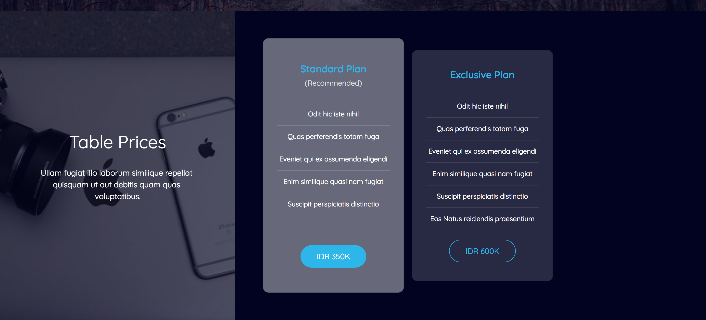

<!-- Divider -->
<p align="center">:wavy_dash::wavy_dash::wavy_dash::wavy_dash:</p>
<!-- Divider -->

#### Membuat Section Client Says

Selanjutnya adalah bagian client says, dimana ini adalah bagian testimony dari para customer yang menggunakan jasa **The Photograph**

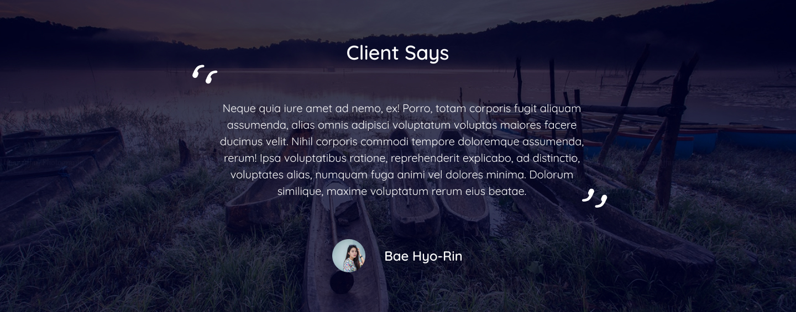

Kita bisa mulai dengan menambahkan code HTML berikut pada file **index.html**

```html
  <!-- Client Says -->
  <section class="section section-overlay section-overlay-client">
    <div class="container">
      <div class="row">
        <div class="col-7 mx-auto text-center">
          <div class="text-xlarge mb-4">Client Says</div>
          <div class="blockquote">
            <p class="text">Neque quia iure amet ad nemo, ex! Porro, totam corporis fugit aliquam assumenda, alias omnis adipisci voluptatum voluptas maiores facere ducimus velit. Nihil corporis commodi tempore doloremque assumenda, rerum! Ipsa voluptatibus ratione, reprehenderit explicabo, ad distinctio, voluptates alias, numquam fuga animi vel dolores minima. Dolorum similique, maxime voluptatum rerum eius beatae.</p>
            <div class="blockquote-user">
              <div class="blockquote-avatar">
                  
              </div>
              <div>Bae Hyo-Rin</div>
            </div>
          </div>
        </div>
      </div>
    </div>
  </section>
```

Lalu kita tambahkan style untuk bagian ini agar lebih rapi, silahkan copy paste code berikut dan tambahkan pada bagian **&-overlay** pada file **components/_section.scss**.

```scss
    &-client {
      min-height: 400px;
      height: auto;
      background-image: url(../img/bg-client.jpeg);
      background-position: center;

      &:before {
        background-color: transparentize($dark, 0.25);
      }
      p {
        margin: 0;
      }
    }
```

Serta tambahkan code berikut ke dalam file **components/_blockquote.scss* untuk mempercantik bagian block quote dan avatar customer–nya.

```scss
.blockquote {
  text-align: center;
  position: relative;

  &:before,
  &:after {
    content: '';
    width: 30px;
    height: 30px;
    background-image: url(../img/quote-1.svg);
    background-repeat: no-repeat;
    background-size: contain;
    position: absolute;
    top: -20px;
    left: -20px;
  }
  &:after {
    top: auto;
    left: auto;
    bottom: 20px;
    right: 20px;
    background-image: url(../img/quote-2.svg);
  }

  &-user {
    display: flex;
    width: 40%;
    margin: 0 auto;
    margin-top: 20px;
  }
  &-avatar {
    width: 40px;
    height: 40px;
    border-radius: 50%;
    overflow: hidden;
    position: relative;
    margin-right: 20px;

    img {
      position: absolute;
      width: auto;
      height: 40px;
      top: 50%;
      left: 50%;
      transform: translateX(-50%) translateY(-50%);
    }
  }
}
```

Dan hasilnya adalah seperti berikut ini.

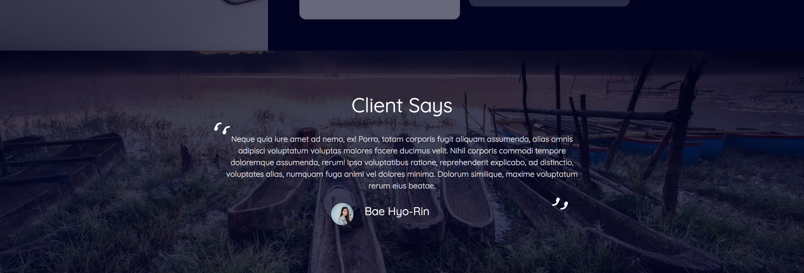

<!-- Divider -->
<p align="center">:wavy_dash::wavy_dash::wavy_dash::wavy_dash:</p>
<!-- Divider -->


#### Membuat Section Footer

Lalu di bagian ini kita akan membuat sebuah menu navigasi tambahan di bagian bawah halaman yaitu menu footer.

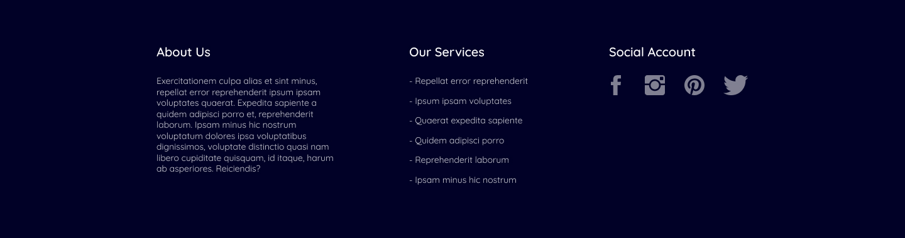

Code-nya cukup simple kalian hanya cukup menambahkan code berikut pada file **index.html** setelah bagian client says.

```html
  <!-- Footer -->
  <section class="section section-footer">
    <div class="container">
      <div class="row">
        <div class="col-4">
          <div class="text-medium mb-3">About Us</div>
          <p class="text">Exercitationem culpa alias et sint minus, repellat error reprehenderit ipsum ipsam voluptates quaerat. Expedita sapiente a quidem adipisci porro et, reprehenderit laborum. Ipsam minus hic nostrum voluptatum dolores ipsa voluptatibus dignissimos, voluptate distinctio quasi nam libero cupiditate quisquam, id itaque, harum ab asperiores. Reiciendis?</p>
        </div>
        <div class="col-4">
          <div class="text-medium mb-3 ml-3">Our Services</div>
          <ul class="nav flex-column">
            <li class="nav-item">
              <a class="nav-link text text-white" href="#">Repellat error reprehenderit</a>
            </li>
            <li class="nav-item">
              <a class="nav-link text text-white" href="#">Ipsum ipsam voluptates</a>
            </li>
            <li class="nav-item">
              <a class="nav-link text text-white" href="#">Quaerat expedita sapiente</a>
            </li>
            <li class="nav-item">
              <a class="nav-link text text-white" href="#">Quidem adipisci porro</a>
            </li>
            <li class="nav-item">
              <a class="nav-link text text-white" href="#">Reprehenderit laborum</a>
            </li>
            <li class="nav-item">
              <a class="nav-link text text-white" href="#">Ipsam minus hic nostrum</a>
            </li>
          </ul>
        </div>
        <div class="col-4">
          <div class="text-medium mb-3 ml-3">Social Account</div>
          <nav class="nav p0 m0">
            <a class="nav-link nav-social text-icon" href="#">
              <i class="ion-social-facebook"></i>
            </a>
            <a class="nav-link nav-social text-icon" href="#">
              <i class="ion-social-instagram"></i>
            </a>
            <a class="nav-link nav-social text-icon" href="#">
              <i class="ion-social-pinterest"></i>
            </a>
            <a class="nav-link nav-social text-icon" href="#">
              <i class="ion-social-twitter"></i>
            </a>
          </nav>
        </div>
      </div>
    </div>
  </section>
```

Dan kita telah selesai menambahkan menu footer seperti di bawah ini.

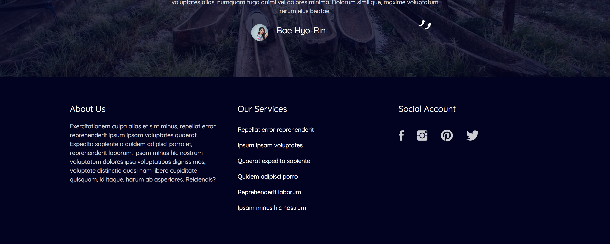

<!-- Divider -->
<p align="center">:wavy_dash::wavy_dash::wavy_dash::wavy_dash:</p>
<!-- Divider -->


#### Membuat Copyright

Dan bagian terakhir adalah section copyright yang berada pada bagian bawah halaman dan kira-kira tampilannya seperti ini.


Pertama silahkan tambahkan code berikut setelah bagian Footer pada file **index.html**.

```html
  <!-- Copyright -->
  <section class="section section-copyright">
    <div class="container">
      <div class="row">
        <div class="col-9 mx-auto text-center">
          <p class="text">Copyright 2018 - Made with ♥ by Muhibbudin Suretno</p>
        </div>
      </div>
    </div>
  </section>
```

Lalu tambahkan code berikut pada bagian file **components/_section.scss** setelah class `&-price {` di bagian bawah file.

```scss
  &-copyright {
    min-height: 40px;
    height: auto;
    padding: 40px 0 20px 0;
    background-color: $black;
  }
```

Dan akhirnya kita telah selesai membuat sebuah halaman sesuai dengan desain yang telah di buat. :smile:

# Memperbaiki Responsive Design

Sebagai tambahan agar desain kita sesuai dengan tampilan desain mobile, kita akan coba merapikan bagian template untuk bagian mobile dengan menggunakan **mixin breakpoint** yang telah kita punya. 

Pertama silahkan buka proyek dalam mode mobile device.

> Jika anda menggunakan Google Chrome silahkan klik kanan > inspect element lalu pilih bagian **Toogle device toolbar**

#### Membuat Aside & Aside Toggle

Selanjutnya jika anda perhatikan bagian navbar adalah bagian pertama yang terlihat berantakan maka dari itu, kita akan coba menghilangkan menu navbar bagian kanan atas dan akan kita pindahkan ke bagian aside di sebelah kiri. Akan ada beberapa file yang akan kita rubah, untuk pertama silahkan rubah isi dari file **components/main.scss** menjadi seperti berikut :

```scss
@import

// core
'core/responsive',
'core/color',
'core/fonts',
'core/text',
'core/animate',

// components
'components/navbar',
'components/section',
'components/button',
'components/card',
'components/countdown',
'components/blockquote',
'components/grid',
'components/aside';

// global style
body {
  font-family: $quicksand;
  font-size: 16px;
  background-color: $dark;

  @include breakpoint(0, 480px) {
    font-size: 14px;
  }
}
```

Selanjutnya kita ganti bagian **navbar-brand** pada navbar menjadi seperti berikut :

```html
      <a class="navbar-brand aside-toggle" href="#"><i class="ion-navicon-round"></i></a>
      <a class="navbar-brand" href="#">Brand</a>
      <a class="navbar-brand additional" href="#">&nbsp;</a>
```

Serta code berikut sebelum section <!~~ Hero ~~> :

```html
  <!-- Aside -->
  <section class="aside"></section>

  <!-- Aside Overlay -->
  <section class="aside-overlay"></section>
```

Lalu tambahkan code berikut pada bagian **.navbar** pada file **components/navbar.scss** :

```scss
  .aside-toggle {
    font-family: inherit;
    display: none;
    font-size: 28px;
  }
  @include breakpoint(0, 768px) {
    justify-content: space-between;

    .aside-toggle {
      display: block;
    }
    &-nav {
      display: none;
    }
  }
```

Setelah itu masukan code berikut sebagai style utama pada component aside di atas pada file **components/_aside.scss** :

```scss
// _aside.scss

.aside {
  width: 300px;
  position: fixed;
  left: -100%;
  top: 0;
  height: 100vh;
  background-color: $indigo;
  z-index: 0;
  transition: all 0.6s ease-in-out;

  &-active {
    left: 0;
    z-index: 1001;
  }
  &-overlay {
    position: fixed;
    top: 0;
    left: 0;
    right: 0;
    bottom: 0;
    z-index: -1;
    background-color: transparentize($black, 0.2);
    opacity: 0;
    transition: all 0.3s ease-in-out;

    &-active {
      opacity: 1;
      z-index: 1000;
    }
  }
  .nav {
    &-item {
      padding: 20px;
      border-bottom: 1px solid transparentize($white, 0.75);
    }
    &-item:last-child {
      border: 0;
    }
    &-link {
      color: $white;
    }
  }
}
```

Sebagai pelengkap tambahkan code berikut pada file **js/main.js** untuk mengaktifkan aside :

```javascript
  function duplicateNavbar(target, source) {
    var clone = $(source).clone();
    clone.removeClass('navbar-nav ml-auto');
    clone.addClass('nav flex-column');

    $(target).html(clone);
  }

  duplicateNavbar('.aside', '.navbar-nav');

  $('.aside-toggle').click(function() {
    $('.aside').addClass('aside-active');
    $('.aside-overlay').addClass('aside-overlay-active');
  });

  $('.aside-overlay').click(function() {
    $('.aside').removeClass('aside-active');
    $('.aside-overlay').removeClass('aside-overlay-active');
  });
```

#### Memperbaiki Overlaping

Ada beberapa content pada template yang menjadi overlap pada kondisi mobile / tablet di karenakan ukurannya yang terlalu besar atau bertumpukan. Maka dari itu kita akan merubah banyak file pada bagian ini, silahkan ikuti secara berurutan bagian mana yang akan kita rubah.

##### File index.html

###### Section Introduction

Kita perbaiki bagian introduction, silahkan rubah code berikut :

```html
<div class="col-9 mx-auto text-center">
```

Menjadi seperti ini 

```html
<div class="col-12 col-sm-9 mx-auto text-center">
```

###### Section Price

Kita perbaiki bagian Price, silahkan rubah code berikut :

```html
        <div class="col-4 text-center section section-overlay-price">
          <div class="section-overlay-inner">
            <div class="text-xlarge mb-4">Table Prices</div>
            <p class="animated delay-1 fadeInUp">Ullam fugiat illo laborum similique repellat <br> quisquam ut aut debitis  quam quas <br> voluptatibus.</p>
          </div>
        </div>
        <div class="col-8 p-5 text-center">
          <div class="card-list">
              <div class="card card-active">
```

Menjadi seperti ini 

```html
        <div class="col-12 col-lg-4 text-center section section-overlay-price">
          <div class="section-overlay-inner">
            <div class="text-xlarge mb-4">Table Prices</div>
            <p class="animated delay-1 fadeInUp">Ullam fugiat illo laborum similique repellat <br> quisquam ut aut debitis  quam quas <br> voluptatibus.</p>
          </div>
        </div>
        <div class="col-12 col-lg-8 p-5 text-center swiper-container">
          <div class="card-list swiper-wrapper">
              <div class="card card-active swiper-slide">
```

Serta code berikut :

```html
<div class="card">
```

Menjadi

```html
<div class="card swiper-slide">
```

###### Section Client Says

Kita perbaiki bagian Client Says, silahkan rubah code berikut :

```html
<div class="col-7 mx-auto text-center">
```

Menjadi seperti ini 

```html
<div class="col-12 col-sm-9 col-lg-7 mx-auto text-center">
```

###### Section Footer

Kita perbaiki bagian Footer, silahkan rubah code berikut :

```html
  <!-- Footer -->
  <section class="section">
    <div class="container">
      <div class="row">
        <div class="col-4">
          <div class="text-medium mb-3">About Us</div>
          <p class="text">Exercitationem culpa alias et sint minus, repellat error reprehenderit ipsum ipsam voluptates quaerat. Expedita sapiente a quidem adipisci porro et, reprehenderit laborum. Ipsam minus hic nostrum voluptatum dolores ipsa voluptatibus dignissimos, voluptate distinctio quasi nam libero cupiditate quisquam, id itaque, harum ab asperiores. Reiciendis?</p>
        </div>
        <div class="col-4">
          <div class="text-medium mb-3 ml-3">Our Services</div>
          <ul class="nav flex-column">
            <li class="nav-item">
              <a class="nav-link text text-white" href="#">Repellat error reprehenderit</a>
            </li>
            <li class="nav-item">
              <a class="nav-link text text-white" href="#">Ipsum ipsam voluptates</a>
            </li>
            <li class="nav-item">
              <a class="nav-link text text-white" href="#">Quaerat expedita sapiente</a>
            </li>
            <li class="nav-item">
              <a class="nav-link text text-white" href="#">Quidem adipisci porro</a>
            </li>
            <li class="nav-item">
              <a class="nav-link text text-white" href="#">Reprehenderit laborum</a>
            </li>
            <li class="nav-item">
              <a class="nav-link text text-white" href="#">Ipsam minus hic nostrum</a>
            </li>
          </ul>
        </div>
        <div class="col-4">
```

Menjadi seperti ini

```html
  <!-- Footer -->
  <section class="section section-footer">
    <div class="container">
      <div class="row">
        <div class="col-12 col-lg-4">
          <div class="text-medium mb-3">About Us</div>
          <p class="text">Exercitationem culpa alias et sint minus, repellat error reprehenderit ipsum ipsam voluptates quaerat. Expedita sapiente a quidem adipisci porro et, reprehenderit laborum. Ipsam minus hic nostrum voluptatum dolores ipsa voluptatibus dignissimos, voluptate distinctio quasi nam libero cupiditate quisquam, id itaque, harum ab asperiores. Reiciendis?</p>
        </div>
        <div class="col-6 col-lg-4">
          <div class="text-medium mb-3 ml-3">Our Services</div>
          <ul class="nav flex-column">
            <li class="nav-item">
              <a class="nav-link text text-white" href="#">Repellat error reprehenderit</a>
            </li>
            <li class="nav-item">
              <a class="nav-link text text-white" href="#">Ipsum ipsam voluptates</a>
            </li>
            <li class="nav-item">
              <a class="nav-link text text-white" href="#">Quaerat expedita sapiente</a>
            </li>
            <li class="nav-item">
              <a class="nav-link text text-white" href="#">Quidem adipisci porro</a>
            </li>
            <li class="nav-item">
              <a class="nav-link text text-white" href="#">Reprehenderit laborum</a>
            </li>
            <li class="nav-item">
              <a class="nav-link text text-white" href="#">Ipsam minus hic nostrum</a>
            </li>
          </ul>
        </div>
        <div class="col-6 col-lg-4">
```

##### File components/_blockquote.scss

Silahkan rubah isi dari file **_blockquote.scss** menjadi seperti berikut :

```scss
.blockquote {
  text-align: center;
  position: relative;

  &:before,
  &:after {
    content: '';
    width: 30px;
    height: 30px;
    background-image: url(../img/quote-1.svg);
    background-repeat: no-repeat;
    background-size: contain;
    position: absolute;
    top: -20px;
    left: -20px;

    @include breakpoint(0, 480px) {
      content: none;
    }
  }
  &:after {
    top: auto;
    left: auto;
    bottom: 20px;
    right: 20px;
    background-image: url(../img/quote-2.svg);
  }

  &-user {
    display: flex;
    width: 40%;
    margin: 0 auto;
    margin-top: 20px;

    @include breakpoint(0, 480px) {
      width: 60%;
    }
  }
  &-avatar {
    width: 40px;
    height: 40px;
    border-radius: 50%;
    overflow: hidden;
    position: relative;
    margin-right: 20px;

    img {
      position: absolute;
      width: auto;
      height: 40px;
      top: 50%;
      left: 50%;
      transform: translateX(-50%) translateY(-50%);
    }
  }
}
```

##### File components/_button.scss

Tambahan di bagian .btn sebelum **&-info {** :

```scss
  @include breakpoint(0, 480px) {
    padding: 8px 28px;
    margin: 10px 0;
    font-size: 14px;
  }
```

##### File components/_card.scss

Silahkan rubah isi dari file **_card.scss** menjadi seperti berikut :

```scss
.card {
  background-color: transparentize($white, 0.85);
  border-radius: 12px;
  margin: 0.5rem;
  padding: 18px 8px;
  width: 18rem;
  
  &-active {
    padding: 30px 8px;
    background-color: transparentize($white, 0.6);
  }
  &-list {
    display: flex;
    align-items: center;

    @include breakpoint(0, 768px) {
      justify-content: center;
    }

    @include breakpoint(0, 480px) {
      justify-content: inherit;
    }
  }
  &-title {
    color: $blue;
  }
  &-subtitle {
    font-size: 15px;
    color: transparentize($white, 0.25);
  }

  .nav {
    min-height: 290px;
    margin-top: 30px;

    &-item {
      padding: 12px 0;
      font-size: 14px;
      border-bottom: 1px solid transparentize($white, 0.85);
    }
    &-item:last-child {
      border: 0;
      margin-bottom: 20px;
    }
  }
}
```

##### File components/_countdown.scss

Silahkan rubah isi dari file **_countown.scss** menjadi seperti berikut :

```scss
.countdown {
  display: flex;
  align-items: center;
  justify-content: center;

  @include breakpoint(0, 480px) {
    margin-top: 20px;
  }
  &-item {
    font-size: 64px;
    line-height: 1.2;

    @include breakpoint(0, 480px) {
      font-size: 32px;
    }
  }
  &-text {
    font-size: 14px;
  }
  &-separator {
    font-size: 36px;
    margin: 0 20px;

    @include breakpoint(0, 480px) {
      margin: 0 10px;
      font-size: 28px;
    }
  }
}
```

##### File components/_grid.scss

Silahkan rubah isi dari file **_grid.scss** menjadi seperti berikut :

```scss
.grid {
  width: 100%;
  display: flex;
  flex-wrap: wrap;

  &-item {
    width: calc(100% / 3);
    height: 300px;
    position: relative;
    overflow: hidden;

    @include breakpoint(0, 768px) {
      width: calc(100% / 2);
      height: 250px;
    }
    @include breakpoint(0, 480px) {
      height: 190px;
    }
    img {
      position: absolute;
      top: 50%;
      left: 50%;
      transform: translateX(-50%) translateY(-50%);
      width: 100%;
      height: auto;
      transition: all 0.8s ease;

      @include breakpoint(0, 480px) {
        transform: scale(1.6) translateX(-30%) translateY(-30%);
      }
    }
    &:hover > .grid-overlay {
      opacity: 1;
    }
    &:hover > img {
      filter: grayscale(100);
      transform: scale(1.2) translateX(-40%) translateY(-40%);

      @include breakpoint(0, 480px) {
        transform: scale(1.8) translateX(-30%) translateY(-30%);
      }
    }
  }
  &-overlay {
    position: absolute;
    top: 0;
    left: 0;
    bottom: 0;
    right: 0;
    background-color: transparentize($black, 0.4);
    z-index: 10;
    display: flex;
    align-items: center;
    justify-content: center;
    flex-direction: column;
    text-align: center;
    padding: 0 60px;
    opacity: 0;
    transition: opacity 0.3s ease;

    @include breakpoint(0, 480px) {
      padding: 0;
    }
  }
  &-title {
    font-size: 28px;

    @include breakpoint(0, 480px) {
      font-size: 18px;
    }
  }
  &-description {
    font-size: 14px;
    margin: 20px 0;

    @include breakpoint(0, 480px) {
      display: none;
    }
  }
}
```


##### File components/_section.scss

Pada bagian ini kita akan banyak menambahkan class baru pada beberapa bagian, di antaranya silahkan rubah bagian berikut :

Tambahan di bagian &-overlay sebelum **&:before** :

```scss
    @include breakpoint(0, 768px) {
      height: 600px;
    }
```

Perubahan pada bagian img dari :

```scss
      img {
        width: 390px;
        height: auto
      }
```

Menjadi seperti ini :

```scss
      img {
        width: 390px;
        height: auto;

        @include breakpoint(0, 480px) {
          width: 280px;
        }
      }
```

Tambahan di bagian &-price sebelum **&:before** :

```scss
      @include breakpoint(0, 768px) {
        min-height: 200px;
        background-size: cover;
      }
```

Tambahan bagian footer sebelum **&-copyright {**:

```scss
  &-footer {
    @include breakpoint(0, 768px) {
      .col-12 {
        text-align: center;
        margin-bottom: 30px;
      }
    }
  }
```

##### File components/_text.scss

Pada bagian text kita rubah sedikit font-size pada class x-large di mode mobile, silahkan rubah code berikut :

```scss

  &-xlarge {
    font-size: 36px;
  }
```

Menjadi seperti berikut :

```scss

  &-xlarge {
    font-size: 36px;

    @include breakpoint(0, 480px) {
      font-size: 28px;
    }
  }
```

#### Menjalankan Swiper

Terakhir silahkan tambahkan code berikut pada file **js/main.js** 

```javascript
  if ($(window).width() <= 480) {
    new Swiper('.swiper-container', {
      slidesPerView: 1,
      spaceBetween: 10,
      centeredSlides: true
    })
  }
```

# Penutup

Akhirnya materi yang cuku panjang ini bisa saya selesaikan tepat waktu, dengan ini anda telah berhasil membuat sebuah template dari 0 serta mendukung responsive web desain dengan tambahan library. Mohon maaf bila tulisan ini terkesan "terburu-buru" karena saya sendiripun menulisnya dengan keterbatasan waktu yang saya miliki.

Namun saya harap tulisan ini dapat membantu anda semua yang ingin mempelajari bagaimana proses slicing dan templating dari awal hingga akhir, sekiranya ada kesalahan tulisan, kata atau sesuatu hal yang mengganggu silahkan chat saya via telegram @muhibbudins dan akan segera saya revisi tulisan ini.

Sekian dari saya terima kasih telah bergabung bersama **UXD | PHP Indonesia**, sampai jumpa di lain kesempatan.

Waasalamualaikum Wr. Wb.

#### Happy coding! - Muhibbudin Suretno